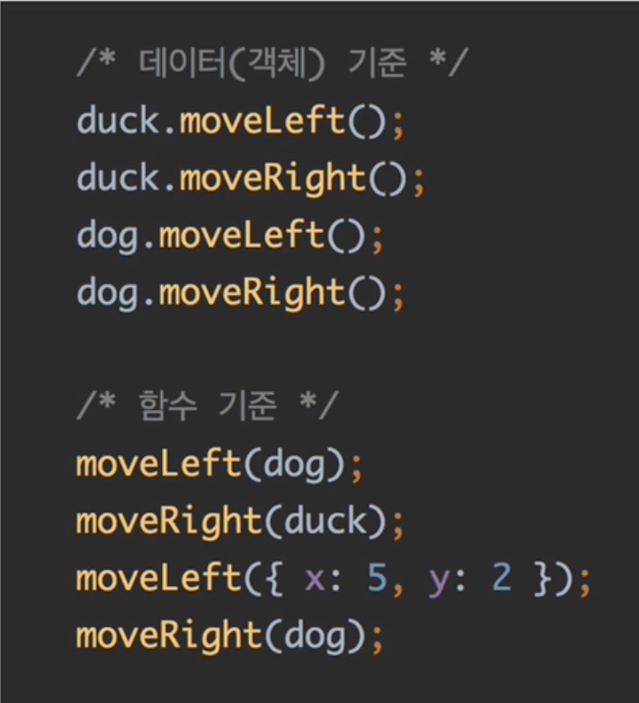

## 성공적인 프로그래밍을 위하여
- 모든 프로그래밍 패러다임은 성공적인 프로그래밍을 위해 존재한다.
- 성공적인 프로그래밍은 좋은 프로그램을 만드는 일이다.
- 좋은 프로그램은 사용성, 성능, 확장성, 기획 변경에 대한 대응력이 좋다.
- 이것을을 효율적이고 생산적으로 이루는 일이 성공적인 프로그래밍이다.

## 함수형 프로그래밍
성공적인 프로그래밍을 위해 부수 효과(side effect)를 지양하고 조합성을 강조하는 프로그래밍 패러다임이다.

- 부수효과를 지양한다 => 순수함수를 만든다.
- 조합성을 강조한다 => 모듈화 수준을 높인다.
- 순수 함수 => 오류를 줄이고 안정성을 높인다.
- 모듈화 수준이 높다 => 생산성을 높인다.

---

- "함수형 프로그래밍은 애플리케이션, 함수의 구성요소, 더 나아가서 언어자체를 함수처럼 여기도록 만뜰고, 이러한 함수 개념을 가장 우선순위에 놓는다."

- "함수형 사고방식은 문제의 해결 방법을 동사(함수)들로 구성(조합)하는 것"

마이클 포거스 [클로저 프로그래밍의 증거움]에서

---

## 평가
- 코드가 계산(Evalutaion) 되어 값(Expression)을 만드는 것.

## 일급 객체(first-class citizens)
- 값으로 다룰 수 있다.
- 변수에 담을 수 있다.
- 함수의 인자로 사용할 수 있다.
- 함수의 결과로 사용할 수 있다.

## 이터러블/이터레이터 프로토콜
- 이터러블: 이터레이터를 리턴하는 \[Symbol.iterator]() 를 가진 값(expression)
- 이터레이터: { value, done } 객체를 리턴하는 next() 를 가진 값
- 이터러블/이터레이터 프로토콜: 이터러블을 for...of, 전개 연산자 등과 함께 동작하도록한 규약(protocol)

## Gernerator
- 이터레이터이자 이터러블을 생성하는 함수. 즉 이터레이터를 리턴하는 함수
- 순회할 값(expression)을 문장(statement)으로 표현한다는 의미를 가진다.
- 문장을 순회할 수 있는 리턴값으로 만들 수 있다. 
- 즉, 자바스크립트에서는 제너레이터를 통해 어떠한 상태나 어떠한 값이라도 순회 하도록 만들 수 있다.
- Gernerator 를 통해 쉽게 제어가능한 이터러블을 만들 수 있다.

## Iterable 중심 프로그래밍에서의 지연평가 (Lazy Evaluation)
- 느긋한 계산법
- Generator/Iterator Protocal 기반으로 구현

## map, filter 계열 함수가 가지는 결함 법칙
- 사용하는 데이터가 무엇이든지
- 사용하는 보조 함수가 순수 함수라면 무엇이든지
- 아래와 같이 결합한다면 둘 다 결과가 같다.

[[mapping, mapping], [filtering, filtering], [mapping, mapping]]

= 

[[mapping, filtering, mapping], [mapping, filtering, mapping]]

